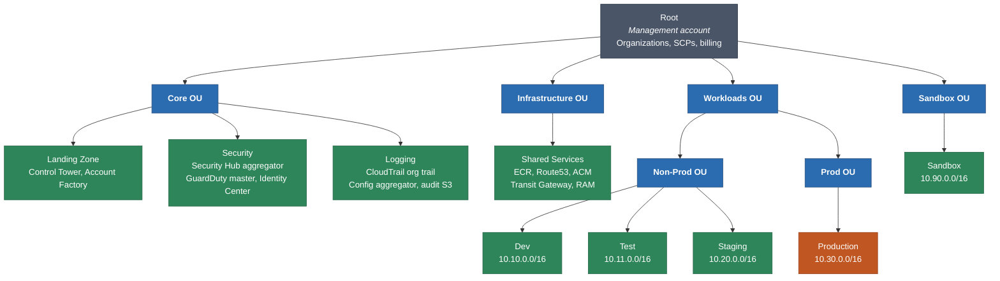
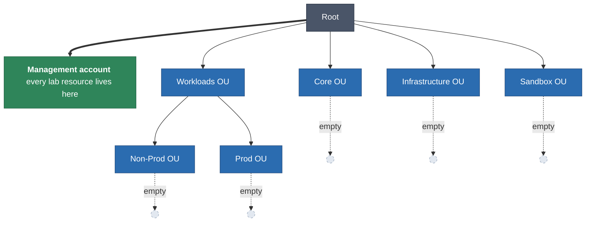
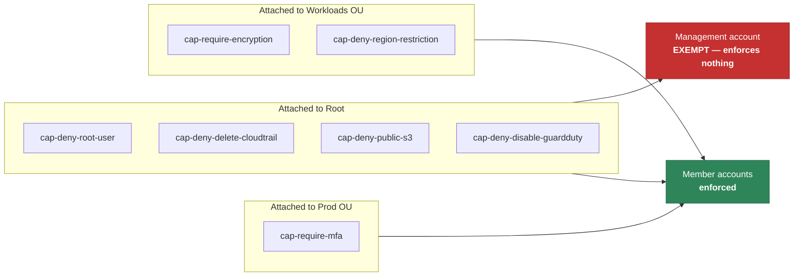

# Organization Topology

> **Navigation:** [Diagram Index](README.md) | [Architecture Overview](../overview.md) | [Governance Layer](../../../terraform/lab/01-governance/README.md) | [ADR-0003](../../adr/0003-multi-account-landing-zone.md)

## Target topology — multi-account

The design `terraform/environments/` implements. Each account is a hard security
and blast-radius boundary; OUs are the unit that Service Control Policies attach
to.

## Lab topology — single account, as deployed

What actually exists in account `<ACCOUNT_ID>` today. The OU tree is real and
identical in shape; there are no member accounts to place inside it, so all
resources live in the management account.

## SCP attachment and its one important limitation

**AWS exempts the Organizations management account from every SCP, without
exception.** In the lab every resource lives in that account, so the seven
policies are attached and reviewable but restrict nothing today. They begin
enforcing the moment member accounts exist. This is a property of AWS, not a
shortcut — see [ADR-0013](../../adr/0013-single-account-lab-profile.md).

A second consequence: the `cap-deny-root-user` policy cannot protect the very
account whose root user you are most likely to use. That gap is why
[layer 00](../../../terraform/lab/00-identity/README.md) exists.

## Root SCP quota

A target accepts at most 5 SCPs and AWS-managed `FullAWSAccess` occupies one, so
the four root attachments sit exactly at quota. A fifth root-level guardrail
must be merged into an existing policy document rather than attached separately.
