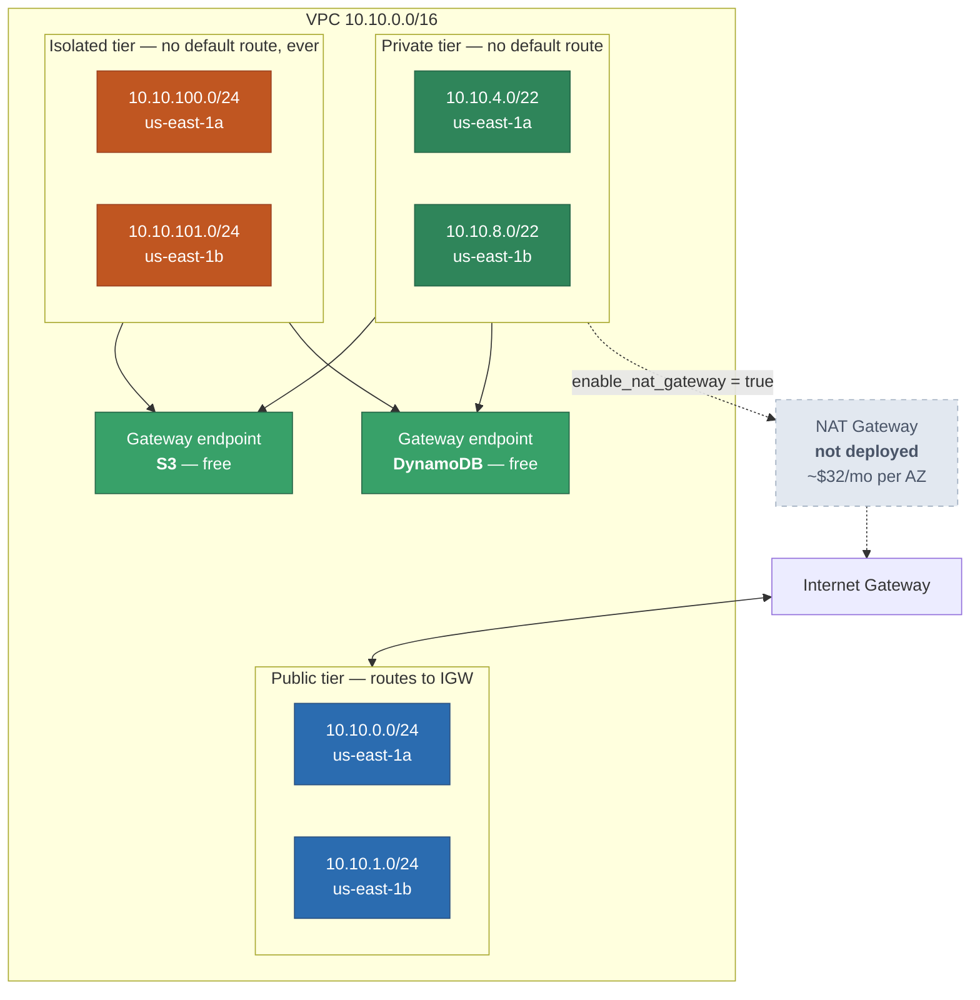
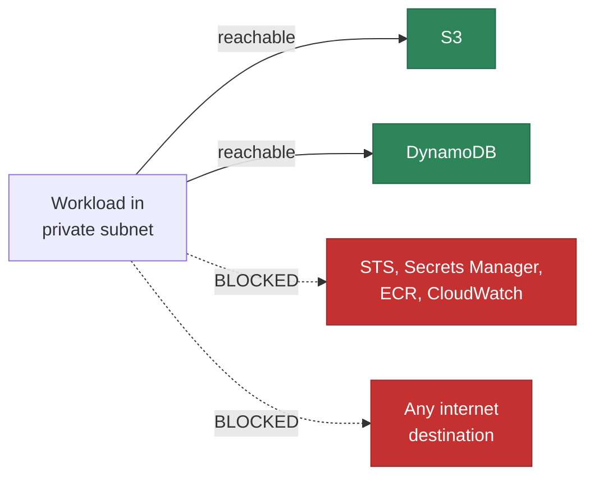
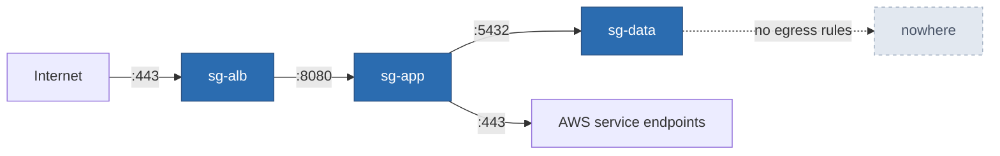
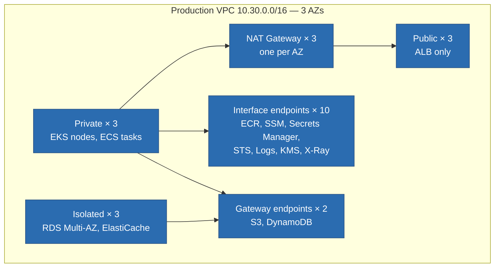

# Network Topology

> **Navigation:** [Diagram Index](README.md) | [Network Layer](../../../terraform/lab/03-network/README.md) | [ADR-0016 No NAT in Lab](../../adr/0016-no-nat-gateway-in-lab.md)

## Lab VPC — as deployed (`<VPC_ID>`)

Three tiers across two AZs, no NAT gateway, no public IPv4 addresses. Private
and isolated subnets reach S3 and DynamoDB through free gateway endpoints and
have no other route off the VPC.

## What "no NAT" means in practice

This is why the sample Lambda runs **outside** the VPC, and why EKS and ECS are
not part of the lab: managed nodes cannot join a cluster they cannot reach.
Setting `enable_interface_endpoints = true` (~$7.30/month per endpoint per AZ)
restores the blocked paths without a NAT gateway.

## Security group chain

Every rule is a discrete `aws_security_group_rule`. Traffic is authorised by
*source security group*, not by CIDR, so the chain holds no matter how subnets
are renumbered.

The data tier has ingress from `sg-app` only and no egress rules at all — a
compromised database cannot initiate an outbound connection.

## Defaults locked down

A new VPC ships with a permissive default security group, NACL and route table.
All three are adopted into Terraform with no rules, so anything launched without
an explicit security group is isolated rather than reachable:

| Default resource | State after apply |
|------------------|-------------------|
| Default security group | no ingress, no egress |
| Default NACL | no allow rules |
| Default (main) route table | no routes |

## Target production VPC

Same shape, three AZs, with the components the lab omits:

One NAT gateway per AZ rather than one shared: a shared gateway makes every AZ
depend on the one it lives in, which converts a single-AZ failure into a
total loss of egress.
