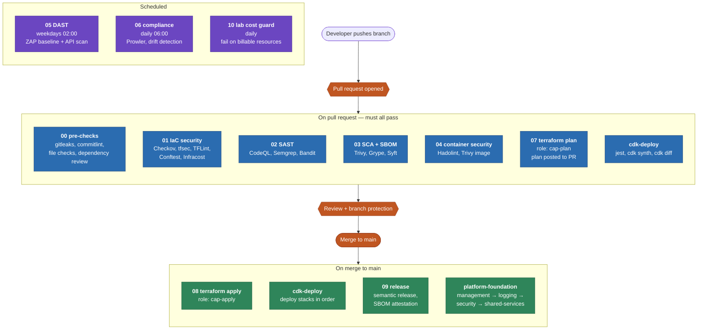
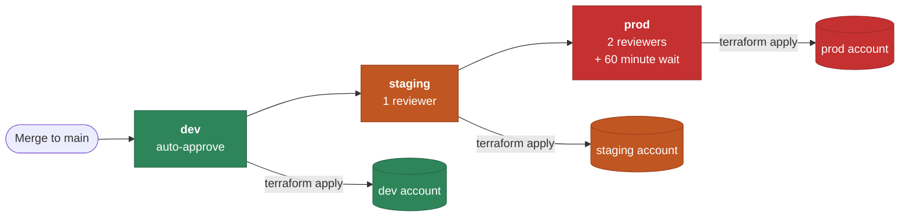
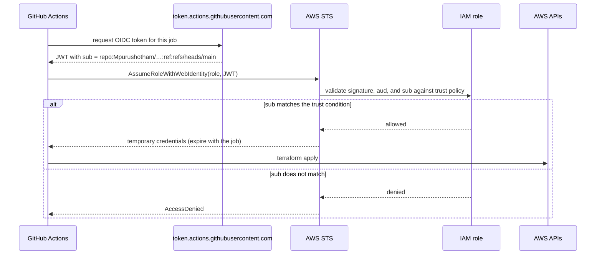
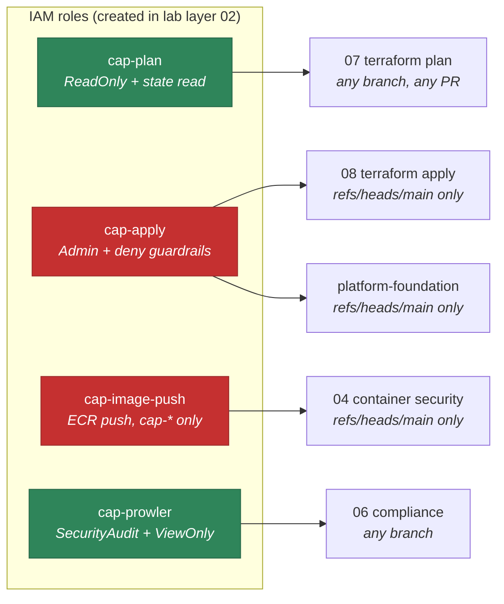
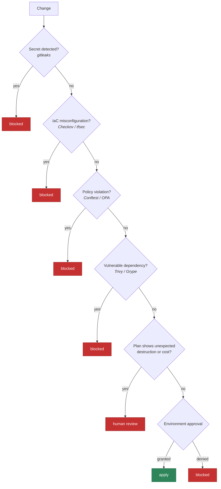

# CI/CD Pipeline Flow

> **Navigation:** [Diagram Index](README.md) | [CI/CD How-To](../../how-to/ci-cd-pipeline.md) | [ADR-0005 OIDC](../../adr/0005-github-oidc-over-static-keys.md) | [ADR-0012 Promotion Gates](../../adr/0012-environment-promotion-gates.md)

## Full pipeline

Twelve workflows, in three bands: everything that runs on a pull request,
everything that runs after merge, and everything that runs on a schedule.

## Promotion gates

Each environment has a different cost of being wrong, so each has a different
gate. These are GitHub *environment* protection rules, enforced by GitHub rather
than by workflow logic — a workflow cannot vote itself past them.

The 60-minute wait on production is not bureaucracy: it is the window in which
someone notices that staging broke. Without it, a bad change reaches production
before its blast radius is visible.

## How a workflow gets AWS credentials

No secret is ever stored. GitHub mints a short-lived JWT per job; AWS verifies
it against the OIDC provider and returns credentials that expire with the job.

The `sub` claim is what makes this safe. `cap-apply` trusts exactly
`repo:Mpurushotham/Cloud-AWS-Platform-Management:ref:refs/heads/main` with
`StringEquals` — a pull request from a fork cannot produce that claim, so it
cannot reach the apply role no matter what the workflow file says.

## Role-to-workflow map

## Where each gate can stop a change

Shift-left ordering is deliberate: the cheapest checks run first, so a commit
with a leaked secret fails in seconds rather than after a fifteen-minute image
build.
