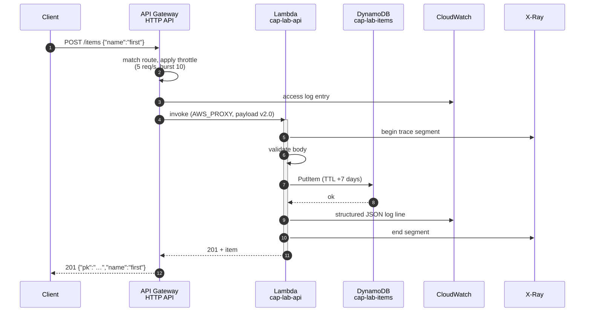
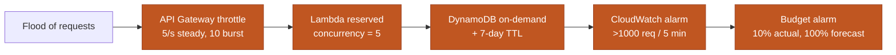
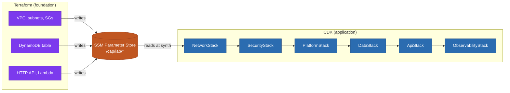
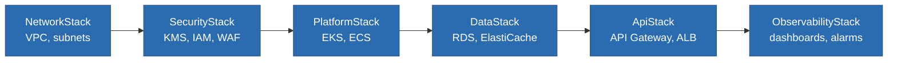

# Request Path and Terraform → CDK Handoff

> **Navigation:** [Diagram Index](README.md) | [Workload Layer](../../../terraform/lab/04-workload/README.md) | [ADR-0008 SSM Handoff](../../adr/0008-ssm-parameter-store-handoff.md)

## Deployed request path

The lab's sample API, as it actually runs. Every hop is inside the free tier.



Failure paths are explicit rather than incidental:

| Condition | Response | Why |
|-----------|----------|-----|
| Body is not JSON | `400 body must be valid JSON` | caller error, safe to describe |
| `name` missing | `400 field 'name' is required` | caller error, safe to describe |
| Route not registered | `404` from API Gateway | never reaches Lambda, never billed |
| DynamoDB error | `502 upstream service error` | AWS error code logged, not returned |
| Unhandled exception | `500 internal error` | stack trace logged, never returned |

Returning the AWS error code to the caller would disclose table names and ARNs,
so the code goes to CloudWatch and the caller gets a generic message with a
request ID.

## Cost guardrails on this path



Five independent limits. Any one of them failing still leaves four in the path —
which is the point, because the API is deliberately unauthenticated so that
`curl` can demonstrate it.

## Terraform → CDK handoff

Terraform owns foundational resources; CDK owns application stacks. They are
joined through SSM Parameter Store rather than shared state or CloudFormation
exports.



### Why SSM and not the alternatives

| Approach | Why it was rejected |
|----------|---------------------|
| CDK reads Terraform remote state | CDK would need read access to the state bucket, and state contains every resource attribute in the account — far more than the handful of IDs it needs |
| CloudFormation exports | An exported value cannot be changed or deleted while any stack imports it, which produces stacks that cannot be updated or deleted |
| Hard-coded IDs in `cdk.json` | Silently wrong after any Terraform change that replaces a resource |
| SSM Parameter Store | Loosely coupled, versioned, IAM-scopable per parameter path, free at Standard tier |

Parameters currently published by layer 04:

```
/cap/lab/api/id              /cap/lab/table/name
/cap/lab/api/endpoint        /cap/lab/table/arn
/cap/lab/api/execution-arn   /cap/lab/function/name
/cap/lab/alarms/topic-arn    /cap/lab/function/arn
```

## CDK stack dependency order

Enforced with `addDependency`, not by declaration order — CDK synthesises stacks
in whatever order it likes unless told otherwise.



Security precedes platform because KMS keys must exist before anything asks to
be encrypted with them; observability comes last because it references the ARNs
of everything before it.
