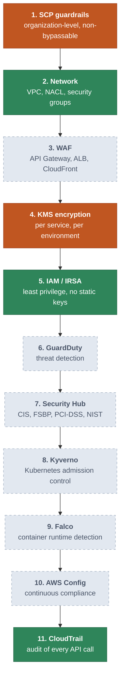
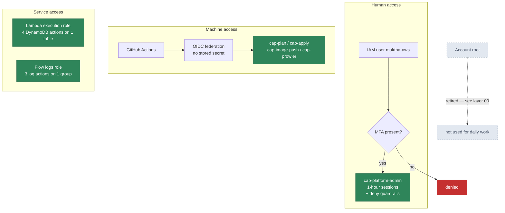
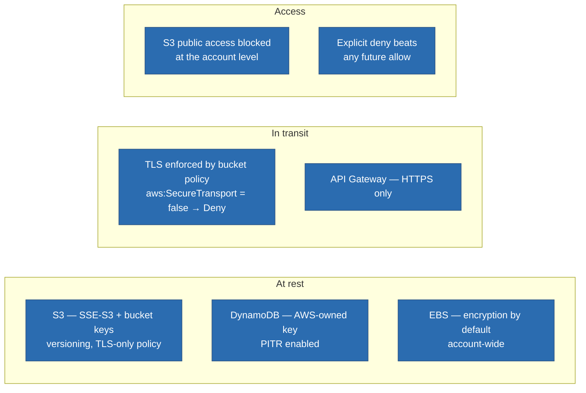
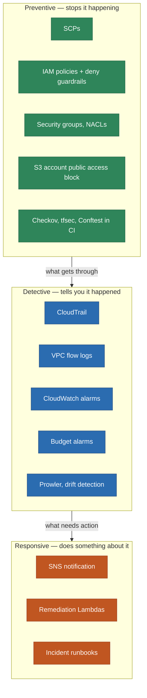
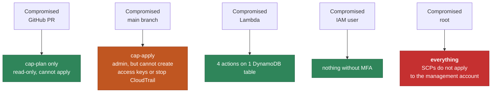

# Security Architecture — Defence in Depth

> **Navigation:** [Diagram Index](README.md) | [Security Best Practices](../../security/security-best-practices.md) | [Known Issues](../../security/known-issues.md) | [ADR-0006 SCPs](../../adr/0006-scps-as-preventive-guardrails.md)

## Eleven layers, and which of them the lab actually has

The value of layering is that no single control is load-bearing. The table below
is honest about what is deployed today versus what the target design specifies —
a diagram that shows eleven green layers when four are running is worse than no
diagram.

| | Layer | Lab status | Why |
|---|-------|-----------|-----|
| 1 | SCP guardrails | **partial** | 7 policies attached; management account is exempt, so nothing is enforced until member accounts exist |
| 2 | Network | **deployed** | VPC, 3 tiers, locked-down defaults, SG chain, NACL, flow logs |
| 3 | WAF | absent | WAFv2 web ACL is ~$5/month + per-rule and per-request charges |
| 4 | KMS | **partial** | AWS-managed keys only; customer-managed keys cost $1/month each |
| 5 | IAM / IRSA | **deployed** | OIDC federation, 4 scoped CI roles, MFA-gated admin role, no static keys |
| 6 | GuardDuty | absent | free for 30 days, then billed per event volume |
| 7 | Security Hub | absent | free for 30 days, then billed per check |
| 8 | Kyverno | absent | requires a Kubernetes cluster; EKS is $73/month |
| 9 | Falco | absent | same |
| 10 | AWS Config | absent | billed per configuration item and per rule evaluation |
| 11 | CloudTrail | **deployed** | organization trail, multi-region, log file validation on |

Policy files for the absent layers are committed and reviewable under
`security/` and `kubernetes/` — they are switched off, not missing.

## Identity and access

Every execution role names its resources explicitly. The Lambda role, for
example, grants exactly `PutItem`, `GetItem`, `Query` and `Scan` on one table
ARN — not `dynamodb:*` on `*`, and not the `AWSLambdaBasicExecutionRole` managed
policy, which grants `logs:*` across every log group in the account.

## Data protection

## Preventive, detective, responsive

Preventive controls are worth more than detective ones because they do not
depend on anybody reading an alert. But they can only encode what you already
thought of, which is why the detective layer is not optional.

## Blast radius

What an attacker reaches from each starting point, given the controls that are
actually deployed:

The red box is the honest conclusion of this whole architecture: in a
single-account deployment, root compromise is unbounded and no guardrail in this
repository changes that. Separating workloads into member accounts is what makes
the SCP layer real, and it is the single highest-value change available.
