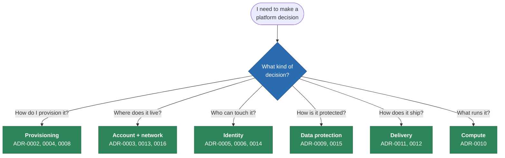
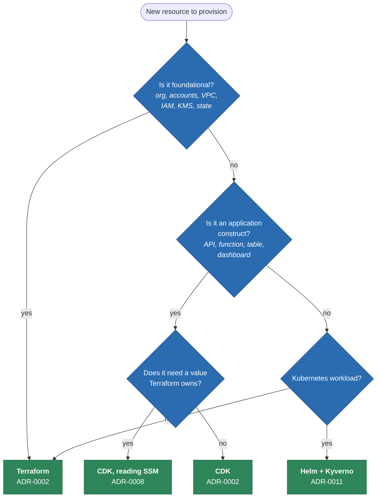
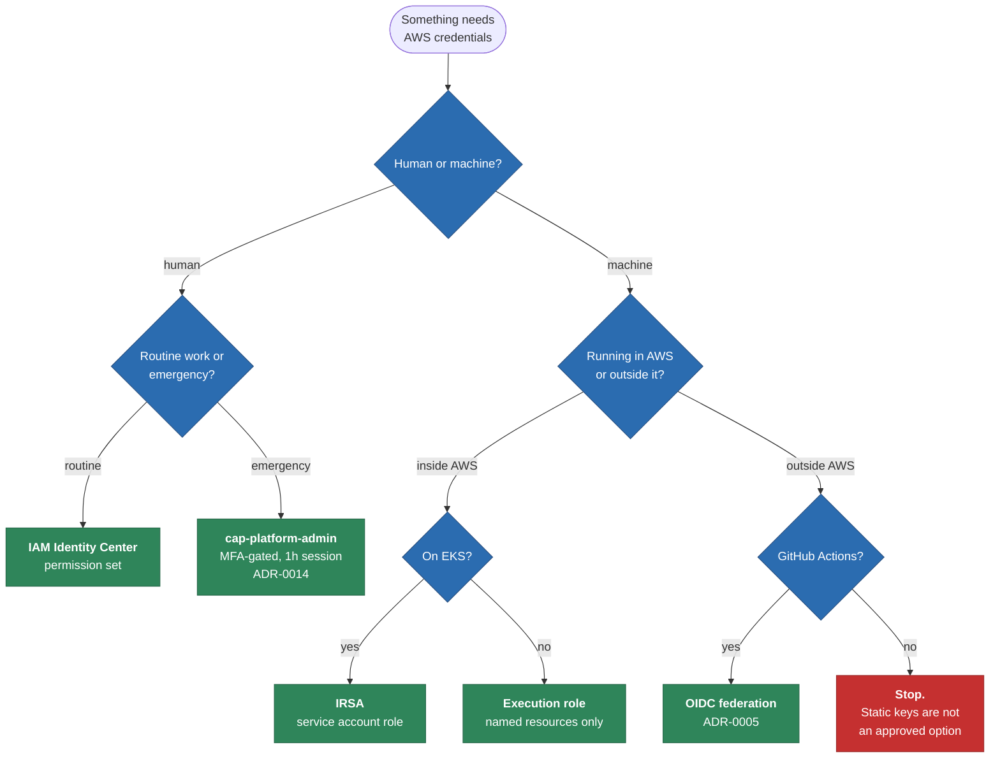
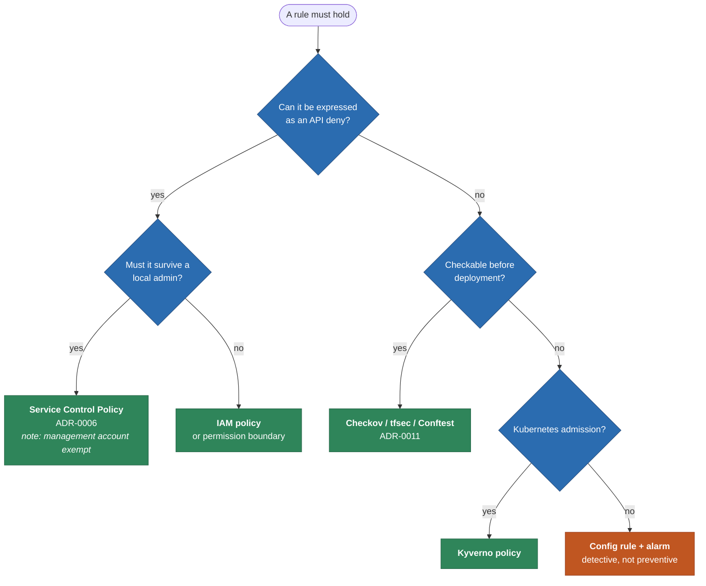
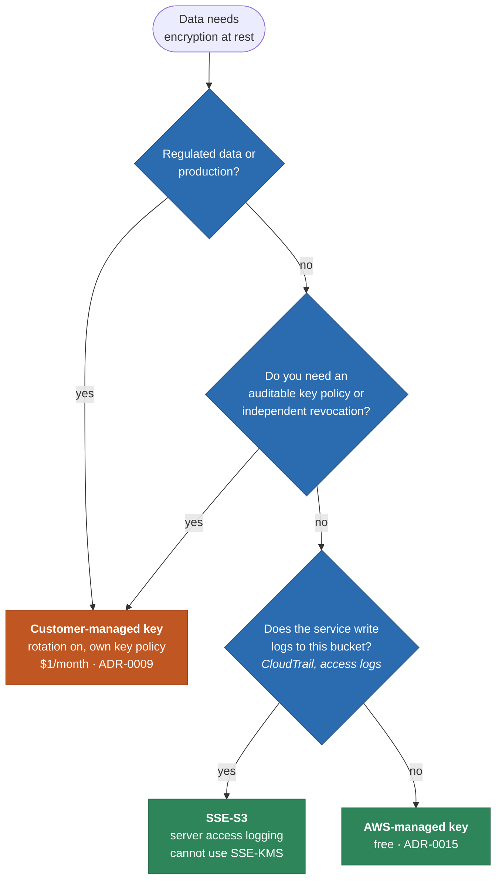
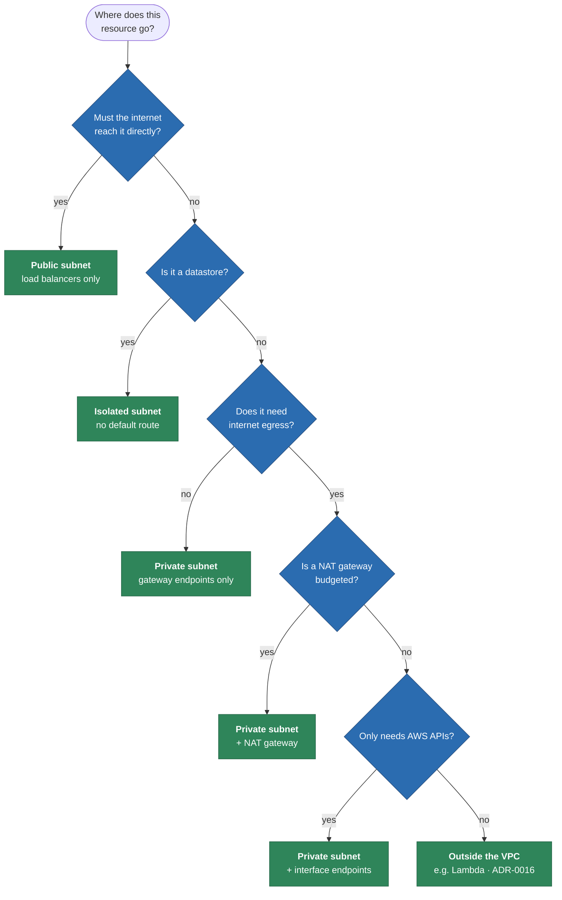
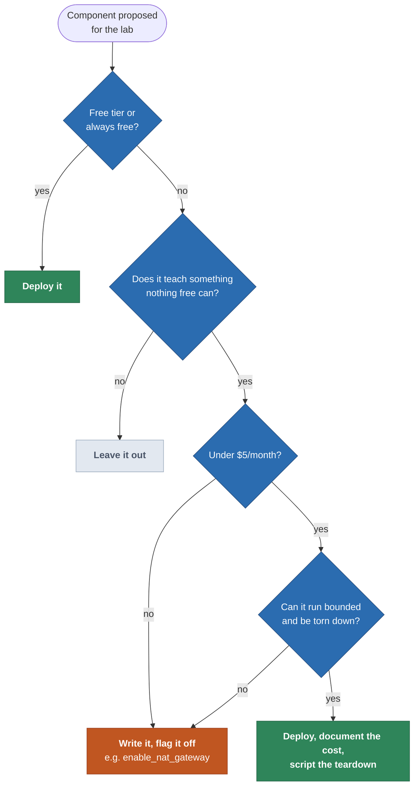

# ADR Decision Tree

> **Navigation:** [Diagram Index](README.md) | [ADR Index and Rationale](../../adr/README.md) | [Decision Guide](../decision-guide.md)

The decision tree is a navigational index over the ADRs: you arrive with a
question, follow the branches, and land on the record that already answered it.
Its purpose is described in full in [the ADR index](../../adr/README.md#why-a-decision-tree)
— this page is the map itself.

## Master tree — start here

## Provisioning: which tool owns this resource?

## Identity: how does this principal authenticate?

## Guardrails: preventive or detective?

## Encryption: which key?

## Network placement: which subnet tier?

## Cost: should this exist in the lab?

The tree that governed every choice in `terraform/lab/`.

Every "flag it off" outcome is why `terraform/lab/` has variables like
`enable_nat_gateway` and `enable_interface_endpoints` rather than deleted code:
the production shape stays reviewable in the repository without being billed for.
