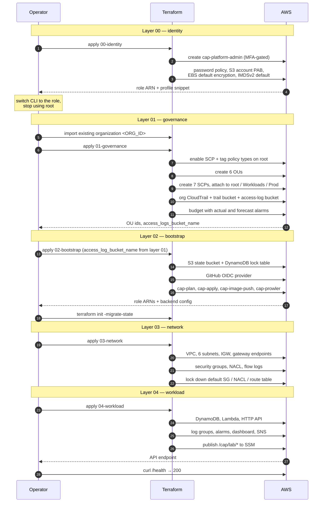
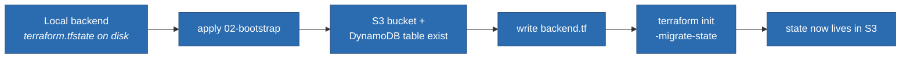
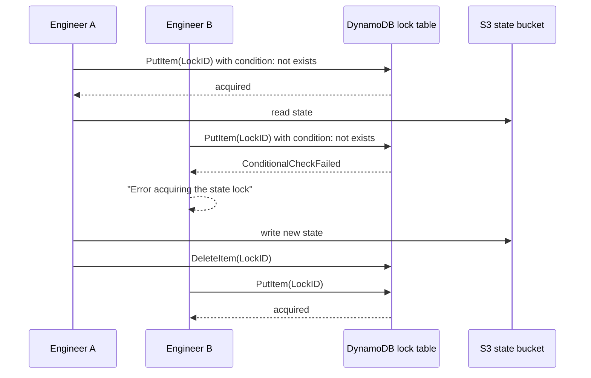
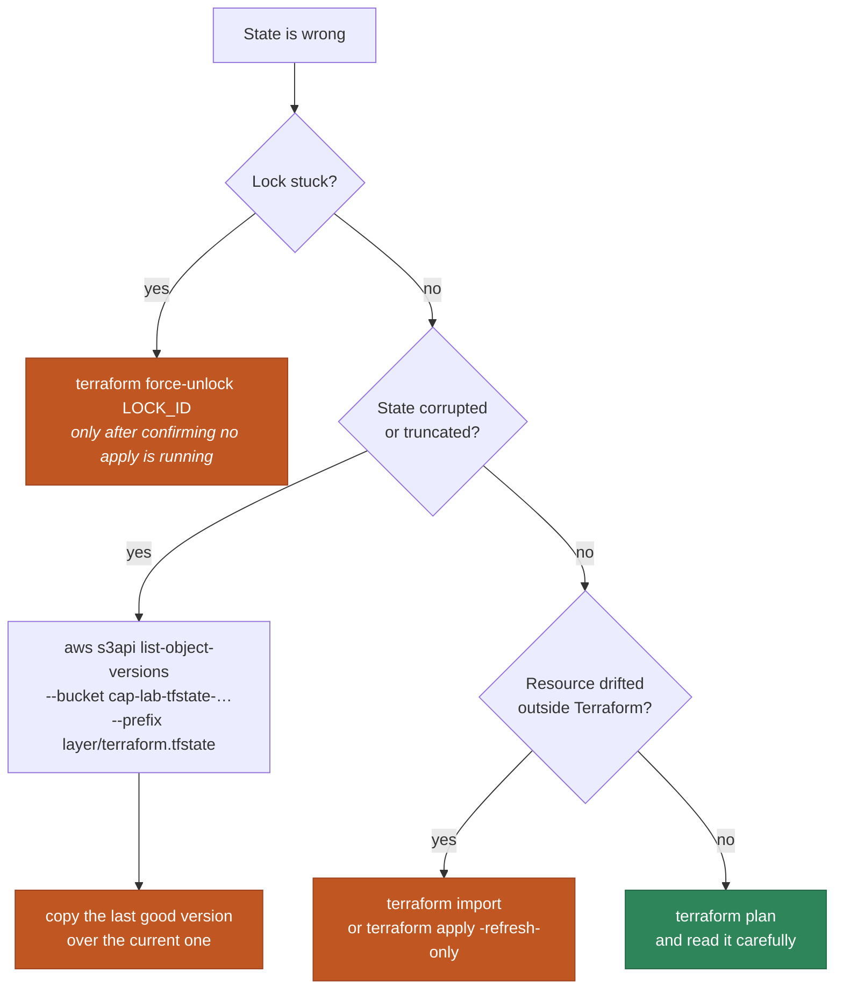

# Bootstrap and State Management

> **Navigation:** [Diagram Index](README.md) | [Lab Setup Runbook](../../how-to/lab-setup-free-tier.md) | [Bootstrap How-To](../../how-to/bootstrap-platform.md) | [ADR-0004 State Backend](../../adr/0004-s3-dynamodb-state-backend.md)

## Lab bootstrap order — as executed

Each layer consumes outputs from the one before it. The ordering is not
stylistic: layer 02 cannot write access logs before layer 01 creates the bucket,
and layer 04 has nothing to hand off until layer 03 exists.



## The bootstrap chicken-and-egg

Layer 02 creates the very bucket that layer 02 wants to store its state in.



Every other layer skips straight to the S3 backend, because by the time it runs
the bucket already exists.

## State locking



The conditional write is what makes this safe — two applies cannot both believe
they hold the lock. Without it, concurrent applies interleave writes and produce
a state file describing infrastructure that never existed.

## Recovering from a corrupted state file

Bucket versioning exists for exactly this.



`prevent_destroy` on the state bucket and lock table means Terraform refuses to
delete them even when told to — the one class of mistake that is genuinely
unrecoverable.

## State key layout

```
s3://cap-lab-tfstate-<ACCOUNT_ID>/
├── lab/identity/terraform.tfstate
├── lab/governance/terraform.tfstate
├── lab/bootstrap/terraform.tfstate
├── lab/network/terraform.tfstate
└── lab/workload/terraform.tfstate
```

One state file per layer, not one for everything. A single state means every
apply takes a lock on every resource, a corrupt file loses the whole platform,
and the blast radius of `terraform destroy` is the entire account.
