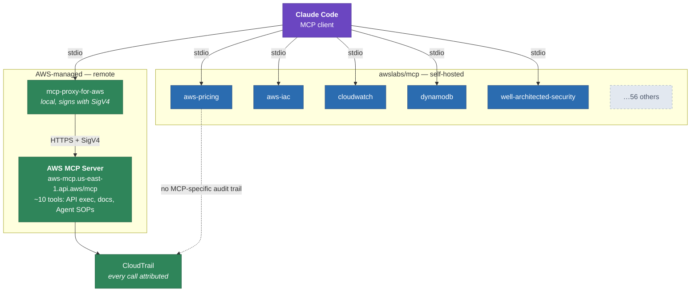
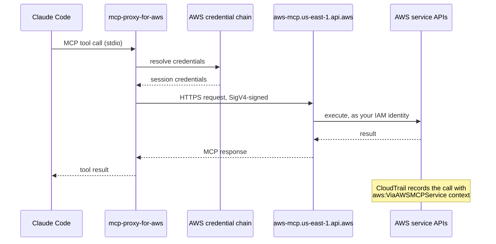
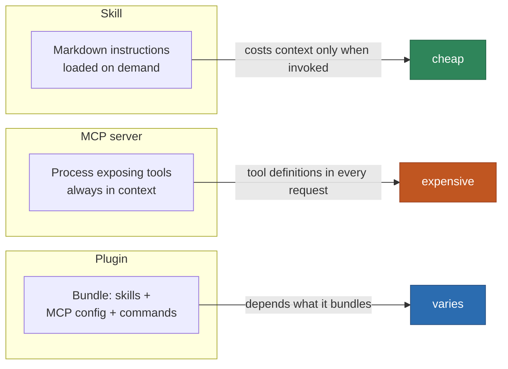
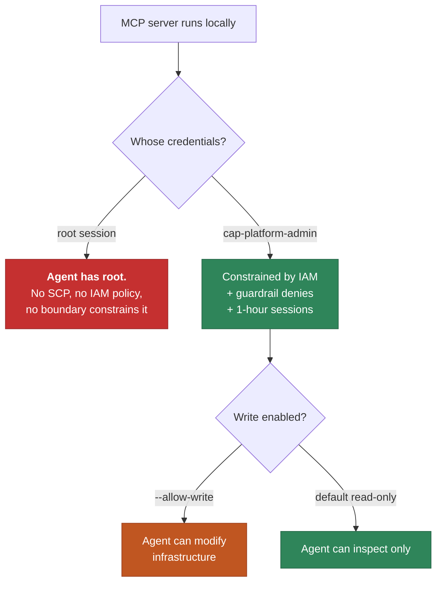
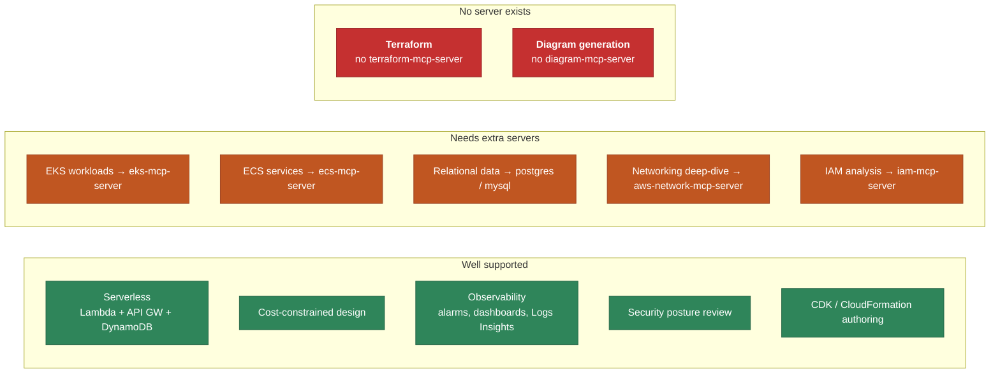

# AWS MCP Servers with Claude Code

> **Navigation:** [Docs Index](../README.md) | [Architecture Diagrams](../architecture/diagrams/README.md) | [Security Best Practices](../security/security-best-practices.md)

How this repository connects Claude Code to AWS through the Model Context
Protocol: what is configured, what each piece costs you in performance, and how
to use it.

**Verified against `awslabs/mcp` and the Agent Toolkit for AWS as of July 2026.**
The catalogue moves quickly — `terraform-mcp-server` and `diagram-mcp-server`
both existed in earlier guidance and **no longer exist**; their functionality was
folded into `aws-iac-mcp-server` and the managed server. Check the live list
before trusting any tutorial, including this one:

```bash
gh api repos/awslabs/mcp/contents/src --jq '.[].name'
```

---

## 1. What MCP actually is here

MCP is a protocol that lets Claude Code call external tools. An MCP *server* is
a process exposing a set of tools; Claude Code is the *client*. AWS ships two
distinct families, and the distinction matters:



| | AWS MCP Server (managed) | awslabs/mcp servers |
|---|---|---|
| Hosting | AWS, remote endpoint | your machine, via `uvx` |
| Auth | SigV4 through a local proxy | your AWS credential chain directly |
| Audit | CloudTrail, with MCP context | ordinary CloudTrail for the API calls |
| Scope | broad: all AWS APIs + docs + SOPs | narrow: one service or workflow each |
| Count | 1 server, ~10 tools | 61 servers available |
| Cost | free (you pay only for resources created) | free |
| GA | 6 May 2026 | varies per server |

**It supersedes `aws-api-mcp-server` and `aws-knowledge-mcp-server`.** AWS
recommends removing both — overlapping tools reduce agent performance.

---

## 2. Authentication

The managed server requires SigV4, but MCP clients speak OAuth for remote
servers. AWS bridges the gap with `mcp-proxy-for-aws`, a local process that signs
each request from your normal credential chain.



Your CLI already uses `aws login` (CLI 2.32+), which is the simplest supported
source — auto-rotating sessions up to 12 hours. That is exactly what the proxy
wants, so nothing extra is needed.

> **Do this as a non-root identity.** These servers act with whatever credentials
> they find. Running them from a root session gives an AI agent root, which no
> IAM policy and no SCP can constrain. Once the cutover in
> [layer 00](../../terraform/lab/00-identity/README.md) is complete:
> ```bash
> export AWS_PROFILE=cap-lab
> ```
> The `.mcp.json` in this repository honours `AWS_PROFILE`.

---

## 3. What is configured in this repository

[`.mcp.json`](../../.mcp.json) at the repo root, so it applies to anyone working
in this project:

| Server | Why it is here | Mode |
|--------|----------------|------|
| `aws-pricing` | The lab is budgeted at **$0**. This estimates cost *before* an apply, which is the whole discipline of ADR-0013/0015/0016 | read-only |
| `aws-iac` | CloudFormation and CDK guidance, construct examples, security validation — serves the `cdk/` layer | read-only |
| `cloudwatch` | Metrics, alarms and Logs Insights queries against the observability layer | read-only |
| `dynamodb` | The sample workload's datastore; design guidance and inspection | `DDB-MCP-READONLY=true` |
| `well-architected-security` | Security posture review, matching this repo's focus | read-only |

Five servers, roughly 40–60 tools. That is a deliberate ceiling — see §6.

### Getting the managed server

Install it as a **plugin**, not as another `.mcp.json` entry:

```
/plugin install aws-core@claude-plugins-official
```

Then restart or `/reload-plugins`. Other plugins in the toolkit:

| Plugin | Covers |
|--------|--------|
| `aws-core` | service selection, CDK/CloudFormation, serverless, containers, storage, observability, billing, SDK, deployment |
| `aws-agents` | building agents on Bedrock and AgentCore |
| `aws-data-analytics` | data lake, analytics, ETL |
| `aws-agents-for-devsecops` | incident investigation, vulnerability scanning |

`aws-agents-for-devsecops` comes from the AWS marketplace rather than the
official one:

```
/plugin marketplace add aws/agent-toolkit-for-aws
/plugin install aws-agents-for-devsecops
/reload-plugins
```

For this repository, `aws-core` plus `aws-agents-for-devsecops` is the
combination that matches the work. Skip `aws-agents` and `aws-data-analytics` —
nothing here uses Bedrock or a data lake, and their tools would be pure context
overhead.

---

## 4. Skills, plugins and MCP servers are three different things

They are easy to conflate and behave quite differently.



| | Skill | MCP server | Plugin |
|---|---|---|---|
| What it is | instructions in markdown | a running process | a distributable bundle |
| Can call AWS APIs | no | yes | via the servers it bundles |
| Context cost | only when invoked | **every request** | depends on contents |
| Needs credentials | no | usually yes | usually yes |
| Install | file in a skills directory | `.mcp.json` | `/plugin install` |

The practical consequence: **prefer a skill when the thing you need is
knowledge, and an MCP server only when you need a live API call.** A skill that
explains how to size a DynamoDB table costs nothing until used; an MCP server
that can query DynamoDB costs context in every single request for the rest of
the session.

---

## 5. What each configured server gives you

Exact tool lists change per release; check with `/mcp` in Claude Code. Broadly:

**`aws-pricing`** — query the AWS Price List API, estimate cost of a proposed
architecture, generate a cost report. The highest-value server in this repo:

> *"What would enabling `enable_nat_gateway` and `enable_interface_endpoints`
> actually cost per month in us-east-1?"*

**`aws-iac`** — CDK construct guidance, CloudFormation resource schemas,
security validation of a template before deployment.

**`cloudwatch`** — list and describe alarms, fetch metric statistics, run Logs
Insights queries. Useful against the lab's four alarms and two log groups:

> *"Query /aws/lambda/cap-lab-api for entries where level = error in the last hour."*

**`dynamodb`** — table description, capacity and key-design guidance, read-only
data access. Pinned read-only here so an agent cannot write to `cap-lab-items`.

**`well-architected-security`** — evaluates resources against Well-Architected
security guidance. Overlaps with Prowler in `06-compliance.yml`, but interactive.

---

## 6. Performance — the part most guides omit

**Every MCP server's tool definitions are sent with every request.** They are not
loaded on demand. This has three measurable effects:

1. **Context consumption.** Each tool costs roughly 100–400 tokens of schema.
   Five servers is manageable; twenty is thousands of tokens gone before you
   type anything, on every turn.
2. **Tool-selection accuracy falls as tool count rises.** With overlapping
   servers — say the managed AWS MCP Server *and* `aws-api-mcp-server` — the
   model must choose between near-identical tools. AWS states this plainly:
   overlapping tools "can confuse AI agents and reduce performance."
3. **Startup latency.** Each `uvx` server is a process spawn plus a package
   resolution. `@latest` re-checks the index on every start.

### Rules that follow

| Rule | Reason |
|------|--------|
| Cap at ~5 servers for routine work | keeps tool count in the tens, not hundreds |
| Never run the managed server alongside `aws-api`/`aws-knowledge` | direct tool overlap, explicitly warned against |
| Pin versions instead of `@latest` once stable | removes index lookup from startup, makes behaviour reproducible |
| Enable narrow servers per-task, then remove | a Redshift server has no business in a session about IAM |
| Prefer skills over servers for knowledge | skills cost nothing until invoked |
| Set `FASTMCP_LOG_LEVEL=ERROR` | server logs otherwise interleave with output |

To pin a version:

```json
"args": ["awslabs.aws-pricing-mcp-server==1.0.9"]
```

To check what a session is actually carrying, run `/mcp`.

---

## 7. Security

An MCP server is code running with your AWS credentials, driven by a model
reading text that may be attacker-influenced. Treat it accordingly.



Applied here:

- **Read-only by default.** No server in `.mcp.json` is given `--allow-write` or
  `--allow-sensitive-data-access`. DynamoDB is additionally pinned with
  `DDB-MCP-READONLY=true`.
- **Non-root identity.** `AWS_PROFILE` is honoured so servers run as
  `cap-platform-admin` once the cutover is done.
- **Audit.** The managed server attaches `aws:ViaAWSMCPService` and
  `aws:CalledViaAWSMCP` to CloudTrail entries, and publishes metrics under the
  `AWS-MCP` namespace. Those condition keys can also be used in IAM policy to
  deny sensitive actions when they arrive via MCP:

  ```json
  {
    "Effect": "Deny",
    "Action": ["iam:*", "organizations:*"],
    "Resource": "*",
    "Condition": { "Bool": { "aws:ViaAWSMCPService": "true" } }
  }
  ```

  Self-hosted `awslabs/mcp` servers do **not** set these keys — their calls look
  like any other API call from your identity.
- **`@latest` is a supply-chain decision.** It fetches the newest package at
  every start. Pin versions for anything that touches production.

---

## 8. Architectures these support natively

What the configured set can meaningfully help with, mapped to this repository:



**The Terraform gap is worth stating plainly.** This repository is
Terraform-first, and there is no AWS Terraform MCP server. Claude Code handles
Terraform through ordinary file editing and shell execution — `terraform plan`,
`fmt`, `validate` — which is what built the entire `terraform/lab/` tree. MCP
adds nothing there. Its value in this repo is *around* Terraform: pricing a
change before applying it, checking CloudWatch after, reviewing posture.

**Diagrams likewise.** The seven diagrams in
[`docs/architecture/diagrams/`](../architecture/diagrams/README.md) are Mermaid
written directly. No MCP server was involved and none is needed.

---

## 9. Using it

```bash
# 1. Prerequisites (already present on this machine)
uvx --version && aws --version    # uv, and AWS CLI 2.32+

# 2. Credentials
aws login
export AWS_PROFILE=cap-lab        # once the identity cutover is done

# 3. The repo's servers load automatically from .mcp.json
#    Approve them on first use when Claude Code prompts.

# 4. Add the managed server
#    /plugin install aws-core@claude-plugins-official

# 5. Check what is loaded
#    /mcp
```

Worked examples against this repository:

| Ask | Server used |
|-----|-------------|
| "What would enabling NAT gateways cost per month?" | `aws-pricing` |
| "Show errors in the cap-lab-api log group in the last hour" | `cloudwatch` |
| "Is cap-lab-items configured per DynamoDB best practice?" | `dynamodb` |
| "Review this account against Well-Architected security" | `well-architected-security` |
| "What CDK construct should the ApiStack use?" | `aws-iac` |

### Troubleshooting

| Symptom | Cause |
|---------|-------|
| Server fails to start | `uvx` missing, or no network to PyPI |
| `ExpiredToken` | session lapsed; re-run `aws login` |
| `AccessDenied` on every call | `AWS_PROFILE` points at a profile without permissions |
| Agent picks the wrong tool | too many servers, or overlapping ones — cut back |
| Slow session start | `@latest` resolution; pin versions |

---

## Sources

- [awslabs/mcp](https://github.com/awslabs/mcp) — the 61-server catalogue
- [Agent Toolkit for AWS](https://github.com/aws/agent-toolkit-for-aws) — plugins and skills
- [AWS MCP Server guide (2026)](https://mcp.directory/blog/aws-mcp-server-complete-guide-2026) — managed server endpoint, SigV4 proxy, IAM condition keys
- [awslabs.github.io/mcp](https://awslabs.github.io/mcp/) — per-server documentation
